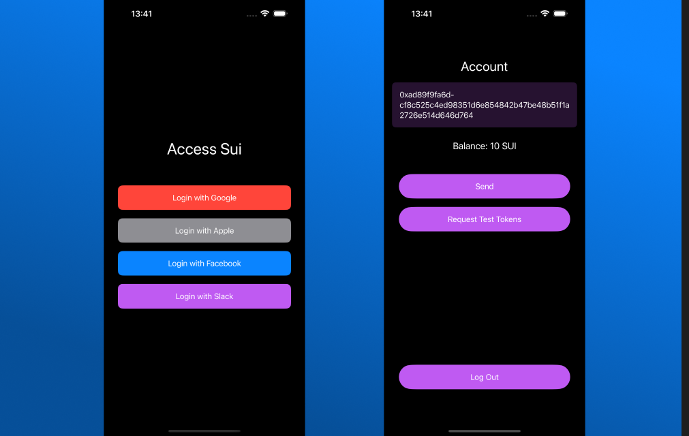

<h1 align="center">ZeroAuth - zkLogin for iOS and macOS, and tvOS</h1>

<p align="center">Simple, Intuitive zkLogin integration for your Apple products</p>


[](https://swift.org/package-manager/)
[](https://developer.apple.com/ios/)
[](LICENSE)
[](https://zeroauth.dev)



- [Requirements](#requirements)
- [Installation](#installation)
- [Usage](#usage)
- [Contributing](#contributing)
- [License](#license)


## Requirements

- iOS 13.0+ / macOS 10.15+

## Installation

### Swift Package Manager

ZeroAuth is available through [Swift Package Manager](https://swift.org/package-manager/). To install it, simply add the 
following dependency to your `Package.swift`:

```swift
dependencies: [
    .package(url: "https://github.com/mcxross/swift-zeroauth.git", .upToNextMajor(from: "0.1.1-beta"))
]
```

## Usage

Once you've successfully added ZeroAuth to your project, simply import the module and start using it:

ZeroAuth generally expects a `ZKLoginRequest` object to be passed to it. This object contains the necessary information 
like the `OpenIDServiceConfiguration`, `SaltingService`, and `ProvingService` to authenticate a user. This is typically 
passed to a `zkLogin` method. A `ZKLoginResponse` object is delivered back to the caller. How the passage and delivery
of these objects is handled depends on the platform you're using.

### iOS SwiftUI

On iOS with SwiftUI, ZeroAuth provided a `ZKLoginModel` which adheres to the `ObservableObject` protocol. This object can
be used to manage the login process and the response through SwiftUI's reactive paradigm. It handles all the authentication
logic. It contains a published property `response` which is updated when the login process is _complete_. You can use this
to update your UI depending on the response.

The `ZKLoginModel` also wraps the `UnauthenticatedViewModel` which can be used to call the `zkLogin` method. This method
typically expects a `ZKLoginRequest` object to be passed to it.

In your main view, you can use the `ZKLoginModel` as follows:

```swift
import ZeroAuth

@ObservedObject private var model: ZKLoginModel

if model.response != nil {
    // Handle the response accordingly. Usually, this means updating the UI to reflect the user's authentication status
 } else {
    // Show the login UI. On the model, call the `getUnauthenticatedViewModel` method to get the UnauthenticatedViewModel
}

```

In your login view, you can use the `UnauthenticatedViewModel` as follows:

```swift
import ZeroAuth
import ZeroAuthCore

let google = ZKLoginRequest(openIDServiceConfiguration: OpenIDServiceConfiguration(provider: Google(), 
                                                                                   clientId: "<YOUR-CLIENT-ID>",
                                                                                   redirectUri: "<YOUR-REDIRECT-URI>"),
                                                                                   saltingService: DefaultSaltingService())

// You can now call the `zkLogin` method on the model as a result of a user action or whatever triggers the login process

model.zkLogin(zkLoginRequest: google)

```

For more information, please refer to the [documentation](https://zeroauth.dev).

## Contributing

We welcome contributions to ZeroAuth. If you'd like to contribute, please open a pull request explaining the changes you'd like to make.

## License

```text
    Copyright 2022 McXross

    Licensed under the Apache License, Version 2.0 (the "License");
    you may not use this file except in compliance with the License.
    You may obtain a copy of the License at

       http://www.apache.org/licenses/LICENSE-2.0

    Unless required by applicable law or agreed to in writing, software
    distributed under the License is distributed on an "AS IS" BASIS,
    WITHOUT WARRANTIES OR CONDITIONS OF ANY KIND, either express or implied.
    See the License for the specific language governing permissions and
    limitations under the License.
```

